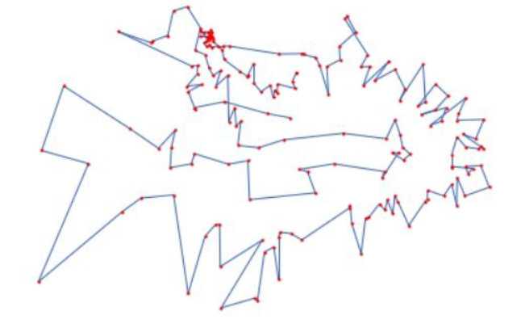
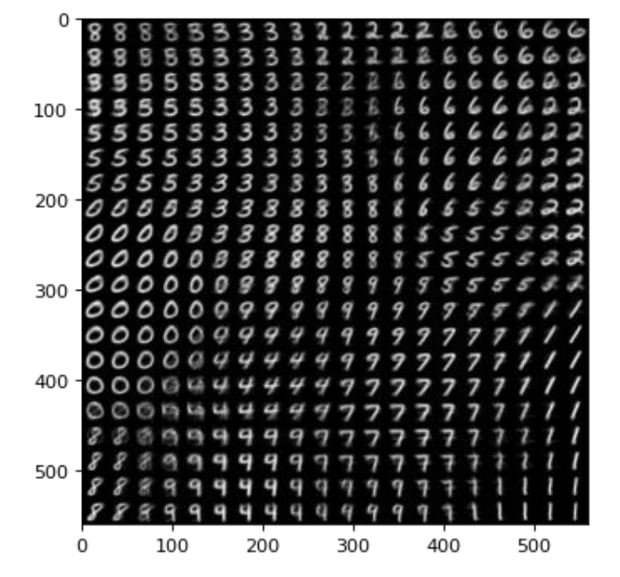

# Kohonen Model
This repository try to implement solution to problems that is possible to be solved by Kohonen. 

## TSP Kohonen
Kohonen can gather similar data near each other. As we Traveling Salesman Problem(TSP) is a NP-Hard problem. So I came up with a solution that approximately solve this problem. So Kohenen weights tell us which two cities are next to each other. for each city we held a comptetion to see which weight is winning and then show cities in an ascending way. With this approach TSP problem is solved approximately.

    

## Cluster Kohonen
Kohonen can also be used for clustering task. I loaded mnist dataset images. We know that this datasets comprises hand written number between 0 to 9. Kohonen can make shape them in a way that similar images appears next to each other while non-similar images get far as much as possible.

    

